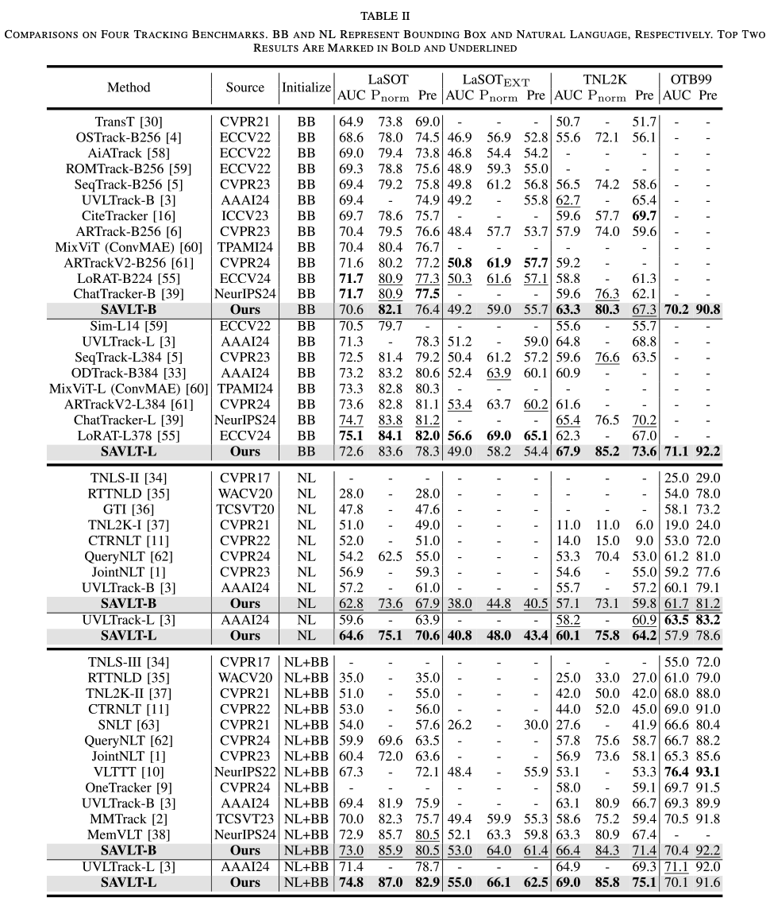

# Self-Adaptive Vision-Language Tracking With Context Prompting (SAVLT)
PyTorch implementation of "Self-Adaptive Vision-Language Tracking With Context Prompting" (IEEE TIP)

Paper can be found [here](https://ieeexplore.ieee.org/document/11284903).

## Introduction
To address the substantial gap between vision and language modalities, along with the mismatch problem between fixed language descriptions and dynamic visual information, we propose a self-adaptive vision-language tracking framework that leverages the pre-trained multi-modal CLIP model to obtain well-aligned visual-language representations. A novel context-aware prompting mechanism is introduced to dynamically adapt linguistic cues based on the evolving visual context during tracking. Our framework employs a unified one-stream Transformer architecture, supporting joint training for both vision-only and vision-language tracking scenarios. 

## Install the environment
Please refer to install.sh for environment installation, and set your own project/model/data paths.

## Training and Testing
Please see eval.sh to find the commands for training and testing.

## Models and Results
The required pretrained models are provided [here[pwd:c5ie]](https://pan.baidu.com/s/1bDNAXnV-sSQePm4GkEQtRQ?pwd=c5ie). (Please download, extract, and place them in your own project directory)

We also release our models [here[pwd:jpj8]](https://pan.baidu.com/s/1SxN8KQTYtQvfW5oyjmppMQ?pwd=jpj8) and results [here[pwd:nrkw]](https://pan.baidu.com/s/1NwOm1RU5AfHnQpZBmJLRmQ?pwd=nrkw).

## Acknowledgments
We acknowledge prior excellent works ([SUTrack](https://github.com/chenxin-dlut/SUTrack)) and ([CoCoOP](https://github.com/KaiyangZhou/CoOp)) for inspiring our SAVLT methodology. 
